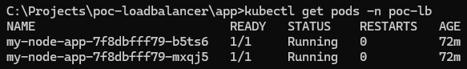
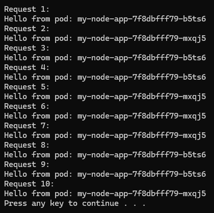
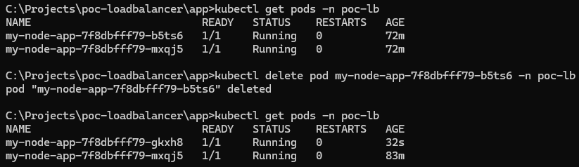
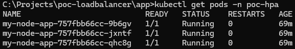
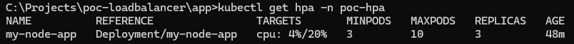
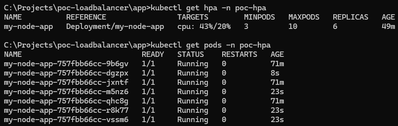
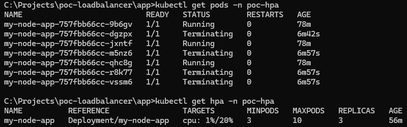
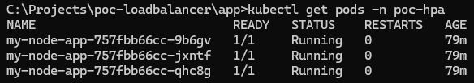

# Kubernetes Proof of Concept

This is a simple program to showcase the proof of concept of load balancing, fault tolerance, and HPA (Horizontal Pod Autoscaler) in Kubernetes.

## Application

- Node.js app that starts a server and binds HTTP server to port 3000. The server will then starts listening for incoming requests, and executes the callback (console.log(...)) once the server is ready.
- This application will also returns "Hello from pod: <pod-name>" as response.
- This application is deployed inside local Minikube and behind a Load Balancer.

---
## Proof of Concept
### Load Balancing

Load balancing distributes incoming traffic across multiple backend instances (pods, servers, etc.) to ensure no single instance is overwhelmed.

Purpose:
- Maximize throughput
- Minimize response time
- Ensure high availability

In Kubernetes:
- The Service object (e.g., type: LoadBalancer) acts as a load balancer.
- It forwards external requests to multiple pods randomly or round-robin.

Pods



Proof
The curl-loop.bat script will exectue curl commands to the exposed URL for 10 times. As per below screenshot, each request/traffic are distributed across the replicas available.



### Fault Tolerance

Fault tolerance is the system's ability to continue operating properly in the event of the failure of one or more components.

Purpose:
- Prevent total system failure
- Provide graceful degradation
- Ensure service continuity

In Kubernetes:
- Kubernetes automatically restarts crashed pods.
- If a node fails, pods are rescheduled on another node.
- With multiple replicas, if one pod crashes, others continue handling traffic.

Proof
After executing the pod delete command to simulate a crashed pod, new pod named "my-node-app-7f8dbfff79-gkxh8" has been created to maintain 2 replicas.
   ```bash
   kubectl delete pod <pod-name> -n poc-lb 
   ```



### HPA (Horizontal Pod Autoscaler)
HPA automatically increases or decreases the number of pod replicas based on CPU usage or other custom metrics.

Purpose:
- Scale up during high load
- Scale down during low load
- Save resources and costs

In Kubernetes:
- You define a target CPU (e.g., 20%).
- Kubernetes watches the average CPU of all pods in the deployment.
- If usage exceeds target, it adds pods; if usage drops, it removes them.

Proof
1. Initial pods created and CPU usage




2. Running below command to perform load test to the pods.
    ```bash
    kubectl run -i --tty busybox --rm --image=busybox -- sh -c "while true; do wget -q -O- http://my-node-service.poc-hpa.svc.cluster.local:81; done"
    ```

3. CPU usage has reached 43% and has exceeded targeted CPU usage of 20%. 4 new pods are scaled up to help on the workloads.



4. After stopping the load test, extra pods are deleted.


